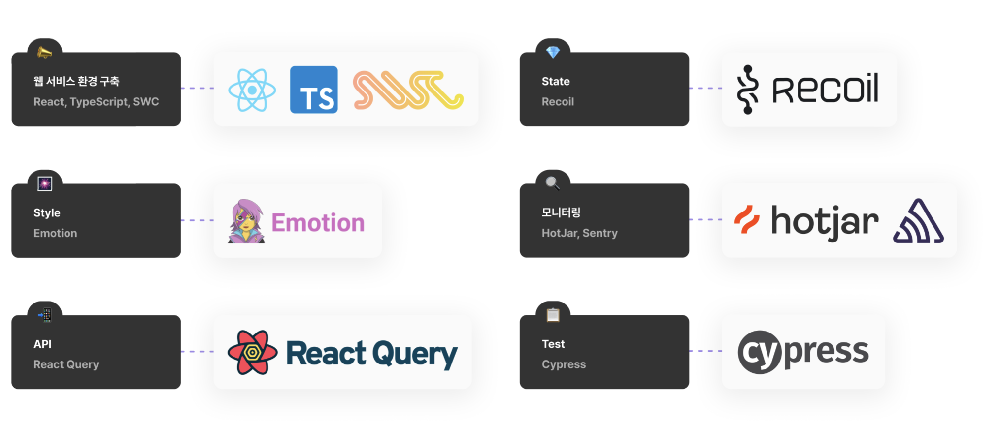
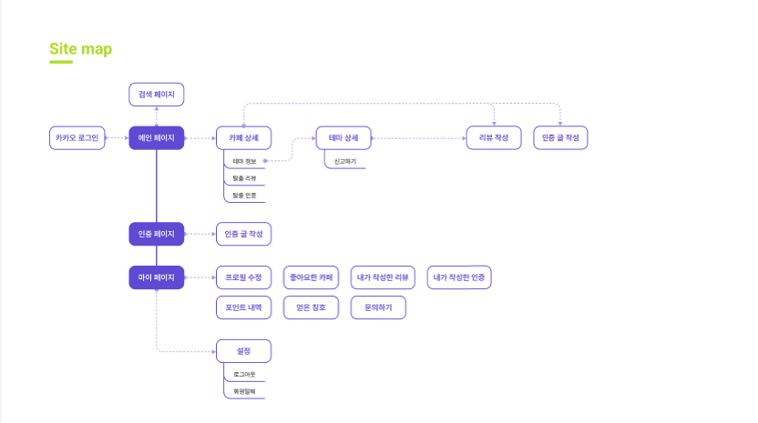

<h1>EXIT</h1>

---

## 💡 서비스 개요

> **EXIT**는 방 탈출 카페와 테마를 추천받고, 방 탈출러들의 리얼 후기와 인증 사진을 모아보고 공유하는 **방 탈출 카페 정보 & 추천 서비스**입니다.

1. 쉽고 편리한 카페 정보
2. 진짜 방문자들의 리얼 후기
3. 기록하고 공유하는 방 탈출

 

## 🕹️ 서비스 목표

방 탈출 카페, 가격은 비싼데 테마에 대한 정보는 별로 없어서 재밌을지도  
모르겠고 탈출 못하면 돈 아까운데...’ 라고 망설이다가 포기한적 있지 않으세요? 
**EXIT**가 대신 딱 맞는 방 탈출 카페를 찾고 즐길 수 있도록 도와줄게요!

 

## 🛠 개발 스택

 

`TypeScript`와 `React`, `React Query`, `swc`를 사용하였고, `Lint`와 `Husky`를 통해 팀의 코드 컨벤션을 유지하고 있습니다. 
`React Native`를 통해 하이브리드 앱으로 패키징해 앱기반 애플리케이션을 구축하였습니다. 
`Hotjar`, `Sentry`를 통해 개발과 기획을 용이하게 하게 하려 했습니다.  
`Hotjar` 기반 데이터를 통해 2차 MVP를 결정하고, `Sentry`를 통해 에러 로그 수집 및 분석에 활용하였습니다. 
전체적인 UI 및 통합 테스트를 위해 `Cypress`를 사용하였습니다. 

 

## 🔦 사이트 맵

 

## 💎 개발자

|                                                 최푸름                                                  |                                                 이민정                                                  |                                                 박준모                                                  |
| :-----------------------------------------------------------------------------------------------------: | :-----------------------------------------------------------------------------------------------------: | :-----------------------------------------------------------------------------------------------------: |
|  |  |  |
|                               [choipureum](https://github.com/choipureum)                               |                                  [lxxmnmn](https://github.com/lxxmnmn)                                  |                                   [JXX-MX](https://github.com/JXX-MX)                                   |

 

## Convention

See our [Convention](https://github.com/DDD-Community/jsonWeb-front/wiki/convention)

 

## Author

See our [CODEOWNERS](./.github/CODEOWNERS) file.

 

## 💻 Release

- https://exitnow.netlify.app (웹)  
- https://github.com/DDD-Community/jsonWeb-app (앱 리소스)  
- https://exitnow.link (서버)  
- https://exitnow.link/admin (관리자)  

 

## 📝 License

This project is [MIT](https://www.apache.org/licenses/MIT) licensed.
